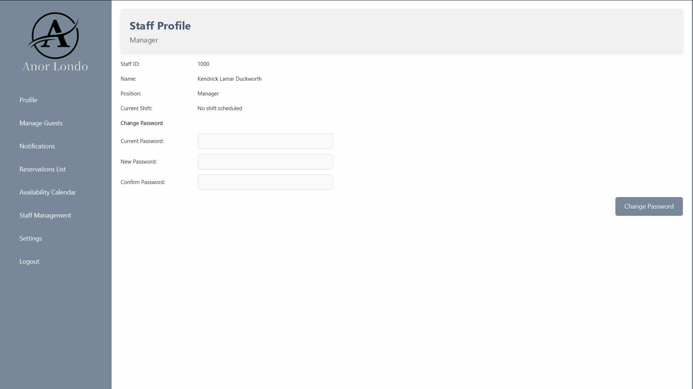

# Hotel Management System 



## Overview

The **Anor Londo Hotel Management System** is a simple JavaFX application designed to simplify hotel operations. Built using the **MVVM (Model-View-ViewModel)** design pattern and backed by a **PostgreSQL** database, this system offers an intuitive interface and robust functionality for efficient management of hotel services.

## Features

- **Room Management:** Track availability, pricing, and details of rooms.
- **Guest Management:** Maintain detailed guest records for easy reference.
- **Booking System:** Streamlined process for managing reservations.
- **Staff Management:** Efficiently manage staff schedules, logs, and access.
- **Notifications and Promotions:** Keep guests informed with automated notifications and promotional updates.
- **Availability Calendar:** Visualize room availability with a calendar view.
- **Settings and Customization:** Configure system preferences to fit hotel-specific needs.

## Technologies Used

- **JavaFX:** For a responsive and user-friendly graphical interface.
- **PostgreSQL:** Reliable and efficient database management.
- **MVVM Design Pattern:** Modular structure for better maintainability and scalability.

## Project Structure

```plaintext
src/
├── main/
│   ├── java/
│   │   └── com/
│   │       └── hotelreservation/
│   │           ├── controller/          # Controllers for handling user interactions
│   │           ├── model/               # Business logic and data structures
│   │           ├── service/             # Services for business logic and database operations
│   │           ├── util/                # Utility classes (e.g., database connections)
│   │           └── view/                # JavaFX controllers for FXML files
│   └── resources/
│       ├── styles/                      # Styling for the application
│       ├── fxml/                        # FXML files for GUI layout
│       └── LogoName.png                 # Application logo
└── target/                              # Compiled classes and resources
```

## Getting Started

1. Clone the repository:
   ```bash
   git clone https://github.com/Chikiran/hotel-management-system.git
   cd hotel-management-system
   ```

2. Ensure you have Java and Maven installed.

3. Build the project:
   ```bash
   mvn clean install
   ```

4. Run the application:
   ```bash
   mvn javafx:run
   ```

